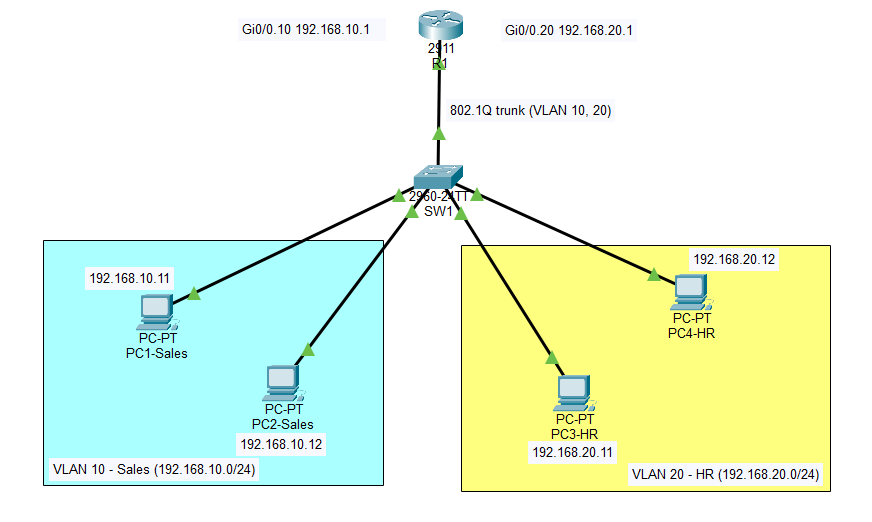

# Lab 1: VLANs and Inter-VLAN Routing (Router-on-a-Stick)

**Tool:** Cisco Packet Tracer 9.0

## Objective
Split one switch into two VLANs (Sales and HR) and let them communicate through a router, using subinterfaces over an 802.1Q trunk.

## Topology

| VLAN | Name  | Subnet          | Gateway      | Hosts |
|------|-------|-----------------|--------------|-------|
| 10   | Sales | 192.168.10.0/24 | 192.168.10.1 | PC1-Sales (.11), PC2-Sales (.12) |
| 20   | HR    | 192.168.20.0/24 | 192.168.20.1 | PC3-HR (.11), PC4-HR (.12) |

| Device | Port  | Connects to |
|--------|-------|-------------|
| R1     | Gi0/0 | SW1 Gi0/1 (802.1Q trunk) |
| SW1    | Fa0/2 | PC1-Sales |
| SW1    | Fa0/3 | PC2-Sales |
| SW1    | Fa0/4 | PC3-HR |
| SW1    | Fa0/5 | PC4-HR |

## What I configured
- **SW1:** created VLANs 10 (Sales) and 20 (HR), set Fa0/2-3 and Fa0/4-5 as access ports, and made Gi0/1 a trunk allowing only VLANs 10 and 20.
- **R1:** created subinterfaces Gi0/0.10 and Gi0/0.20 with dot1Q encapsulation. Each one is the default gateway for its VLAN. The physical interface Gi0/0 has no IP address.

Configs: [SW1-config.txt](SW1-config.txt) | [R1-config.txt](R1-config.txt)
Packet Tracer file: [lab01-vlan-intervlan.pkt](lab01-vlan-intervlan.pkt)

## Verification
| Test | Result | Evidence |
|------|--------|----------|
| Ping within the Sales VLAN | Success, TTL=128 | [screenshot](screenshots/01-same-vlan-ping.png) |
| Ping across VLANs with the router link shut down | Failed, 100% loss | [screenshot](screenshots/02-cross-vlan-ping-fails.png) |
| SW1 VLANs and trunk | Fa0/2-3 in VLAN 10, Fa0/4-5 in VLAN 20, Gi0/1 trunking | [screenshot](screenshots/03-sw1-vlan-and-trunk.png) |
| R1 interfaces and routes | Gi0/0.10 and Gi0/0.20 up, both networks directly connected | [screenshot](screenshots/04-r1-interfaces-and-routes.png) |
| Ping across VLANs with routing enabled | Success, TTL=127 | [screenshot](screenshots/05-cross-vlan-ping-works.png) |
| Traceroute across VLANs | Hop 1 is 192.168.10.1 (R1) | [screenshot](screenshots/06-tracert.png) |

A TTL of 127 instead of 128 shows the packet passed through one router. The first ping can time out while ARP resolves, which is normal.

## Issues I faced and how I fixed them
1. **Trunk not active at first.** `show interfaces trunk` returned nothing and Gi0/1 was still listed under VLAN 1, because the port had not been set to trunk mode yet. I configured `switchport mode trunk` and `switchport trunk allowed vlan 10,20`, and `show interfaces trunk` then showed Gi0/1 trunking with VLANs 10 and 20.
2. **Typo in a ping target** (192.163.20.11 instead of 192.168.20.11). It timed out, but for the wrong reason. I caught it by comparing the address with my IP table.
3. **Cross-VLAN pings kept failing after I re-enabled the router interface.** I had shut down R1's Gi0/0 to capture a failing baseline. After `no shutdown`, pings still timed out. I checked each layer in turn: R1's subinterfaces (up/up, correct IPs), SW1's trunk and VLAN membership (correct), and PC1's IP, mask and gateway (correct). Pings to R1's own 192.168.10.1 worked while 192.168.20.1 did not, which pointed at the router side. It recovered after I re-checked the PC settings and re-entered the default gateway on each PC, and the ping started working again. I could not pin down the exact cause, but I confirmed each layer in turn before it recovered.

## What I learned
Each VLAN is its own subnet, so traffic between VLANs has to go through a layer 3 device. A trunk carries several VLANs over one cable by tagging frames with 802.1Q, and the router uses one subinterface per VLAN as that VLAN's gateway, which is why the physical interface has no IP address. Inter-VLAN routing connects whole subnets, and VLANs are still worth using because they shrink broadcast domains and give one place (the router) to apply ACLs later.
