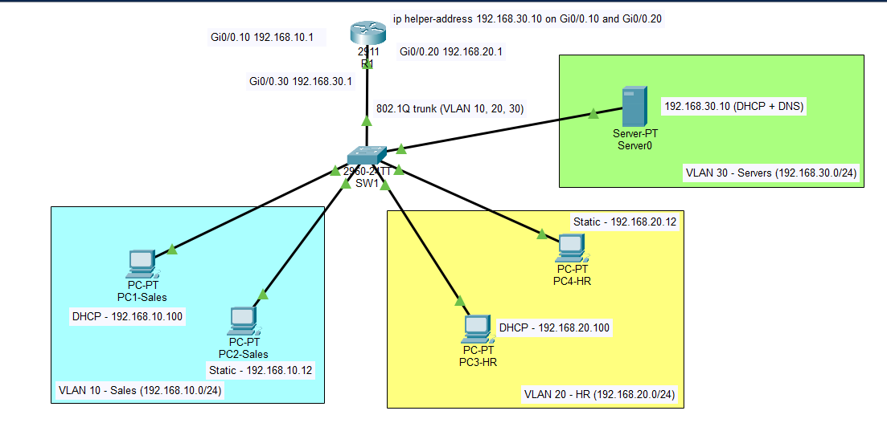
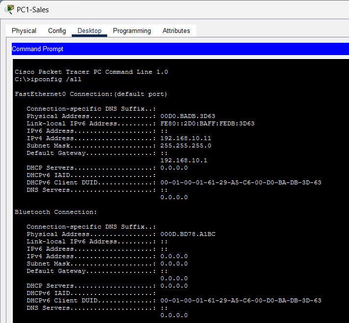
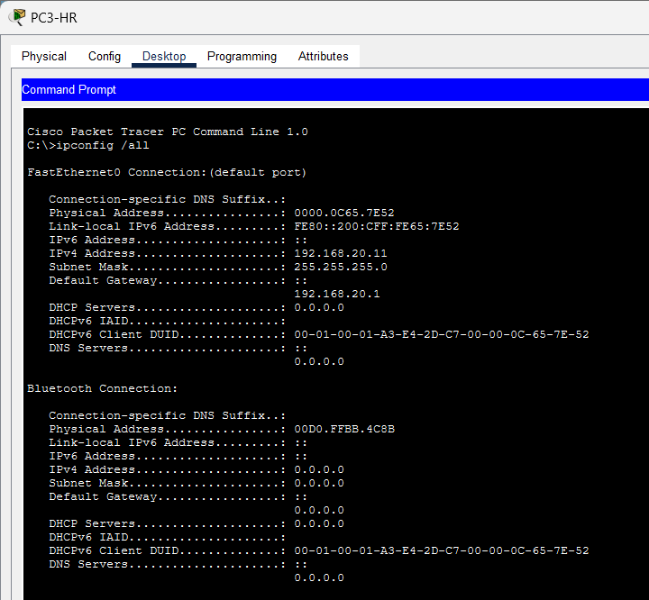
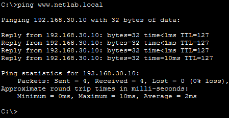
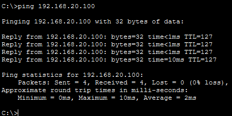
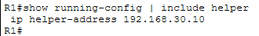
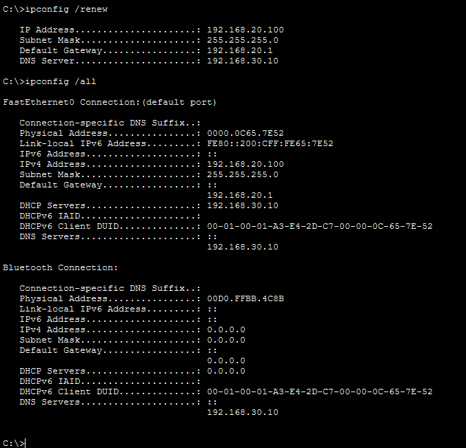

# Lab 2: DHCP and DNS (with DHCP Relay)

**Tool:** Cisco Packet Tracer 9.0
**Builds on:** [Lab 1](../01-vlan-intervlan-routing/)

## Objective
Centralise DHCP and DNS on a server in its own VLAN (VLAN 30) and let clients in other VLANs get their addressing from it through a DHCP relay on the router.

## Topology

| Device | Interface / VLAN | Address |
|---|---|---|
| R1 | Gi0/0.10 (Sales) | 192.168.10.1/24 |
| R1 | Gi0/0.20 (HR) | 192.168.20.1/24 |
| R1 | Gi0/0.30 (Servers) | 192.168.30.1/24 |
| Server0 | VLAN 30 | 192.168.30.10/24 (static, DHCP + DNS) |
| PC1, PC3 | DHCP | Sales pool 192.168.10.100+, HR pool 192.168.20.100+ |
| PC2, PC4 | Static | 192.168.10.12, 192.168.20.12 (outside the pools) |

## What I configured
- VLAN 30 on SW1, with the server port in VLAN 30 and VLAN 30 added to the trunk
- Subinterface `g0/0.30` on R1 as the servers' gateway
- `ip helper-address 192.168.30.10` on `g0/0.10` and `g0/0.20` so DHCP broadcasts reach the server
- Two DHCP pools on Server0 (Sales-Pool, HR-Pool) and a DNS A record for `www.netlab.local`

Configs: [R1-config.txt](R1-config.txt), [SW1-config.txt](SW1-config.txt)

## Verification
| Test | Result |
|---|---|
| Sales PC lease |  |
| HR PC lease |  |
| DNS resolution |  |
| Inter-VLAN ping (Lab 1 still works) |  |

## Troubleshooting

### Fault 1: DHCP failed on every PC (real issue)
- **Symptom:** "DHCP request failed" on all clients.
- **Found with:** `show interfaces trunk` on SW1 showed only VLANs 10,20 allowed.
- **Cause:** VLAN 30 was not allowed on the trunk to R1, so the server was cut off.
- **Fix:** `switchport trunk allowed vlan add 30` on Gi0/1.

### Fault 2: HR clients can't get an address (injected)
- **Symptom:** PC3 got 169.254.x.x while Sales PCs still got leases.
  
- **Diagnosis:** Only one helper-address line in `show running-config | include helper`; `g0/0.20` was missing it.
  
- **Fix:** `ip helper-address 192.168.30.10` under `g0/0.20`.
  

## Notes
- PC2 and PC4 keep static addresses outside the pools to show static and DHCP clients coexisting.
- `serverPool` is Packet Tracer's default pool and is unused.

## Key takeaways
- Routers don't forward broadcasts, so a relay is needed when DHCP is on another subnet.
- If one VLAN breaks and another works, compare their subinterface configs.
